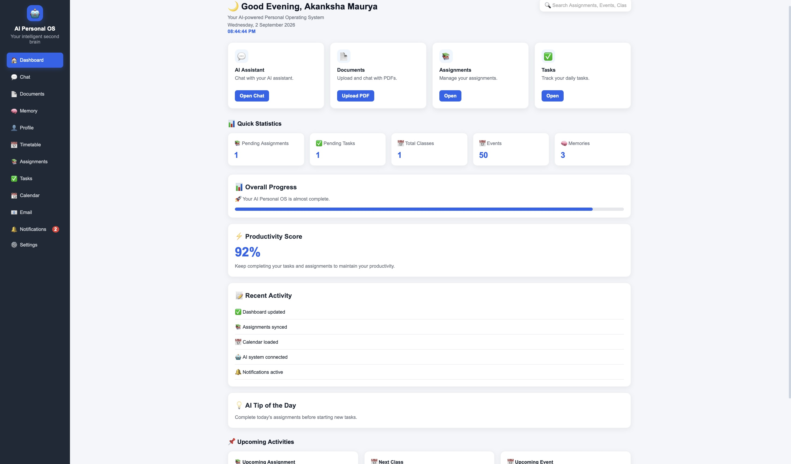
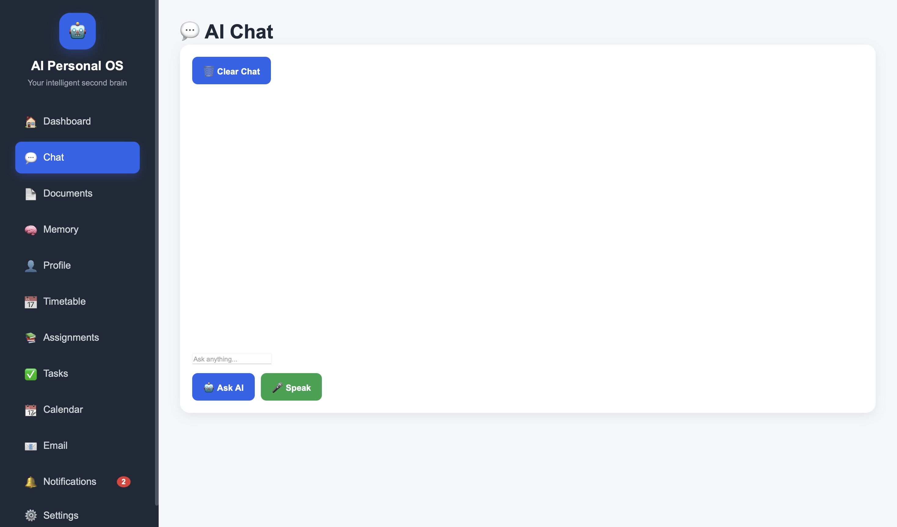
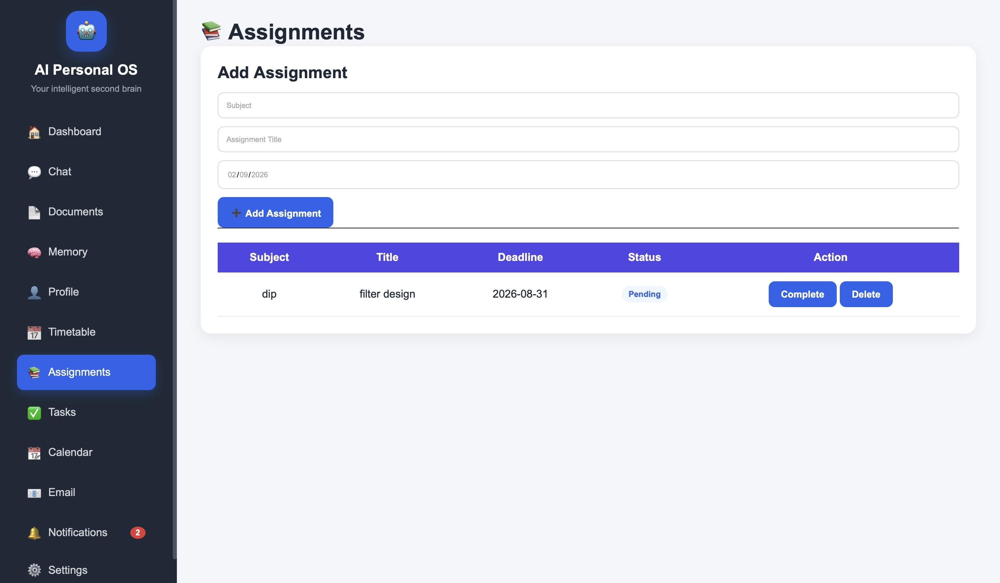
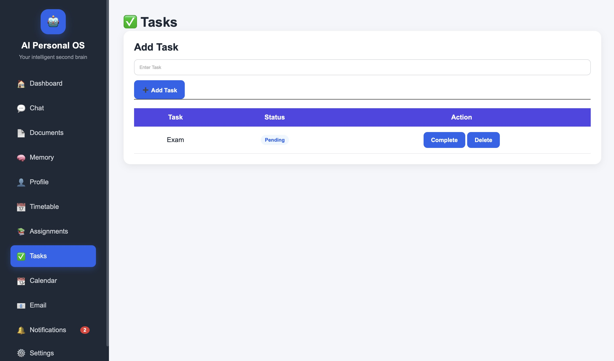
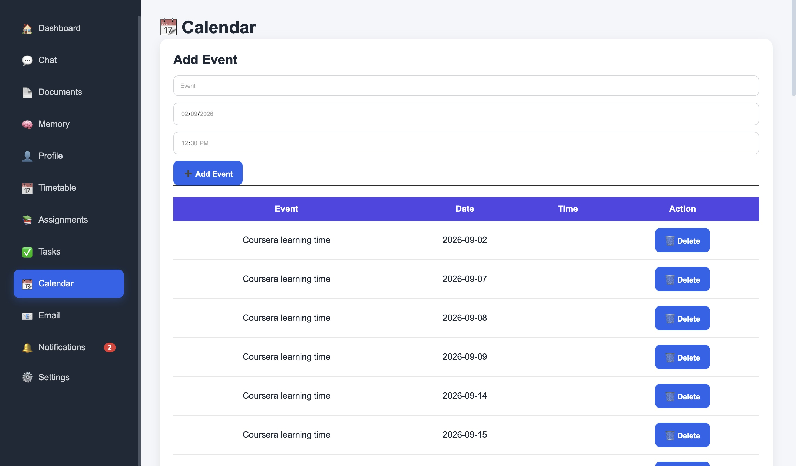
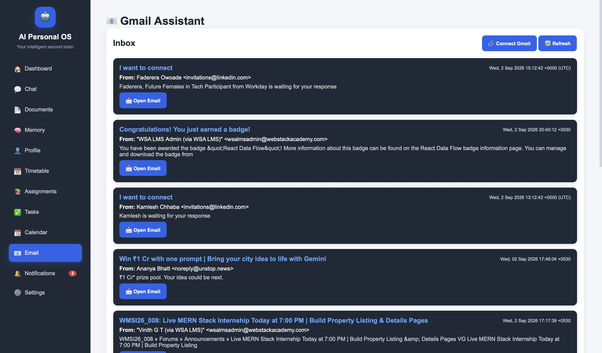

# AI Personal OS

> **A full-stack AI-powered personal workspace that brings tasks, assignments, calendar, email, documents, memory, and AI assistance into one system.**

## 🚀 Features

* 🤖 **AI Assistant** — local AI inference using Ollama
* 🧠 **Personal Memory** — persistent memory and contextual responses
* 📚 **RAG** — upload and query documents using Chroma vector storage
* 📧 **Gmail** — read emails and generate/send AI-assisted replies
* 📅 **Google Calendar** — create, view, and delete events
* 📝 **Productivity** — tasks, assignments, timetable, notes, and dashboard
* 🔔 **Notifications** — task and assignment alerts with browser notifications
* 🎤 **Voice** — speech-to-text and text-to-speech support
* 🔎 **Search** — search across application data
## 📸 Application Preview

### Dashboard


### AI Assistant


### Assignments


### Tasks


### Calendar


### Gmail Integration

## 🏗️ Architecture

```text
                    AI Personal OS
                          │
             ┌────────────┴────────────┐
             │                         │
        Frontend                    FastAPI
      HTML/CSS/JS                  Backend API
             │                         │
             └────────────┬────────────┘
                          │
       ┌──────────────────┼──────────────────┐
       │                  │                  │
    SQLite              Ollama           Chroma
   Application          Local AI          Vector DB
      Data                │                RAG
                          │
                 ┌────────┴────────┐
                 │                 │
              Gmail             Calendar
```

## 🛠️ Tech Stack

**Frontend:** HTML, CSS, JavaScript
**Backend:** Python, FastAPI
**AI:** Ollama
**RAG / Vector DB:** Chroma
**Database:** SQLite
**Integrations:** Gmail API, Google Calendar API
**Version Control:** Git, GitHub

## 🧪 Testing

The backend includes automated API tests covering the main application endpoints.

- Automated API tests    covering core application endpoints
- Tests run with `pytest`
- GitHub Actions automatically runs tests on every push and pull request

## 📂 Project Structure

```text
AI-Personal-OS/
├── backend/
│   ├── api/
│   ├── db/
│   ├── rag/
│   ├── services/
│   ├── tasks/
│   ├── vectorstore/
│   ├── voice/
│   └── main.py
│
├── frontend/
│   ├── index.html
│   ├── script.js
│   └── style.css
│
├── .gitignore
└── README.md
```

## ⚙️ Run Locally

### 1. Clone

```bash
git clone https://github.com/iamakankshamaurya961-lang/AI-Personal-OS.git
cd AI-Personal-OS
```

### 2. Backend

```bash
python3 -m venv venv
source venv/bin/activate
pip install -r requirements.txt
```

### 3. Start Ollama

```bash
ollama serve
```

### 4. Start FastAPI

```bash
uvicorn backend.main:app --reload
```

### 5. Start the Frontend

In a new terminal:

```bash
python3 -m http.server 5500 --directory frontend
```

Then open `http://localhost:5500` in your browser.

## 🔐 Security

Sensitive credentials, environment files, databases, and local runtime data are excluded from version control using `.gitignore`.

**Never commit API keys, OAuth credentials, or access tokens.**

## 🔮 Future Work

* Agentic task planning
* Improved long-term memory
* Better RAG retrieval and evaluation
* Automated scheduling and prioritization
* Docker deployment
* Production deployment

## 👩‍💻 Author

**Akanksha Maurya**
B.Tech — Electronics & Communication Engineering
IIIT Senapati, Manipur

GitHub: **iamakankshamaurya961-lang**

---

⭐ If you find the project interesting, consider starring the repository.
