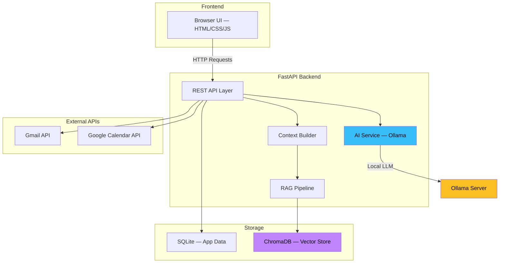

# 🧠 AI Personal OS

[](https://github.com/iamakankshamaurya961-lang/AI-Personal-OS/actions)
[](https://python.org)
[](LICENSE)
[](https://fastapi.tiangolo.com)
[](https://ollama.com)

> **A full-stack AI-powered personal workspace that brings tasks, assignments, calendar, email, documents, memory, and AI assistance into one unified system — powered by local LLM inference.**
 
 ---

## 📸 Application Preview

| Dashboard | AI Chat |
|---|---|
|  |  |

| Assignments & Tasks | Calendar & Gmail |
|---|---|
|  |  |

---

## 🏗️ Architecture



### How It Works

| Component | Technology | Purpose |
|---|---|---|
| **Frontend** | HTML, CSS, JavaScript | Single-page dashboard with real-time UI |
| **Backend** | Python, FastAPI | REST API server with async request handling |
| **AI Engine** | Ollama (local LLM) | Private, local AI inference — no cloud API keys needed |
| **Memory** | ChromaDB (vectors) | Persistent memory via semantic vector embeddings |
| **RAG Pipeline** | Sentence Transformers | Upload PDFs/DOCX → chunk → embed → semantic search |
| **Database** | SQLite | Tasks, assignments, timetable, notes, profile |
| **Integrations** | Google APIs | Gmail read/reply + Calendar create/delete events |

---

## 🌟 Key Features

- 🤖 **AI Assistant** — Local LLM inference via Ollama with persistent conversational memory
- 🧠 **Personal Memory** — AI remembers important facts across sessions using vector embeddings
- 📚 **RAG Document Q&A** — Upload PDFs, DOCX, or TXT files and query them with AI
- 📧 **Gmail Integration** — Read emails, generate AI-assisted replies, send directly
- 📅 **Google Calendar** — Create, view, and delete calendar events
- 📝 **Productivity Suite** — Tasks, assignments, timetable, notes, and a unified dashboard
- 🔔 **Smart Notifications** — Assignment deadlines, pending tasks, and calendar alerts
- 🎤 **Voice Input** — Browser-native speech-to-text for hands-free interaction
- 🔎 **Global Search** — Search across all application data simultaneously

---

## 🚀 Quick Start

### Prerequisites
- Python 3.11+
- [Ollama](https://ollama.com) installed and running
- (Optional) Google Cloud project for Gmail/Calendar integration

### 1. Clone & Install

```bash
git clone https://github.com/iamakankshamaurya961-lang/AI-Personal-OS.git
cd AI-Personal-OS
python3 -m venv venv
source venv/bin/activate
pip install -r requirements.txt
```

### 2. Start Ollama

```bash
ollama serve
ollama pull llama3
```

### 3. Configure (Optional)

```bash
cp .env.example .env
# Edit .env to customize Ollama URL, model, port, timezone
```

### 4. Start the Backend

```bash
uvicorn backend.main:app --reload
```

### 5. Start the Frontend

```bash
python3 -m http.server 5500 --directory frontend
```

Open **http://localhost:5500** in your browser! 🎉

---

## 📡 API Reference

| Method | Endpoint | Description |
|:---|:---|:---|
| `POST` | `/ask` | Send a question to the AI assistant |
| `GET` | `/dashboard` | Get aggregated dashboard stats |
| `GET/POST` | `/tasks` | List / create tasks |
| `PUT` | `/tasks/{id}/complete` | Mark task as completed |
| `DELETE` | `/tasks/{id}` | Delete a task |
| `GET/POST` | `/assignments` | List / create assignments |
| `PUT` | `/assignments/{id}/complete` | Mark assignment done |
| `DELETE` | `/assignments/{id}` | Delete an assignment |
| `GET/POST` | `/timetable` | List / create timetable classes |
| `DELETE` | `/timetable/{id}` | Delete a class |
| `GET/POST` | `/calendar` | List / create calendar events |
| `DELETE` | `/calendar/{id}` | Delete a calendar event |
| `GET/PUT` | `/profile` | Get / update user profile |
| `GET/POST` | `/notes` | List / save notes |
| `POST` | `/upload` | Upload a document for RAG |
| `GET` | `/notifications` | Get smart notification alerts |
| `GET` | `/search?query=...` | Global search across all data |
| `GET` | `/gmail` | List recent Gmail messages |
| `GET` | `/gmail/{id}` | Get full email details |
| `POST` | `/gmail/reply` | Generate AI reply to email |
| `POST` | `/gmail/send-reply` | Send email reply via Gmail |
| `GET` | `/auth/gmail/login` | Start Gmail OAuth flow |

---

## 📁 Project Structure

```
AI-Personal-OS/
├── backend/
│   ├── calendar/
│   │   └── calender_manager.py   # Google Calendar API integration
│   ├── db/
│   │   ├── database.py           # SQLite schema & connection management
│   │   └── models.py             # Data models
│   ├── rag/
│   │   └── document_loader.py    # PDF, DOCX, TXT file parsers
│   ├── services/
│   │   ├── ai_service.py         # Ollama LLM integration
│   │   ├── assignment_service.py # Assignment CRUD operations
│   │   ├── context_builder.py    # AI prompt construction with RAG
│   │   ├── email_ai.py           # AI email summarization & replies
│   │   ├── gmail_reader.py       # Gmail inbox reader
│   │   ├── gmail_service.py      # Gmail OAuth & send operations
│   │   ├── memory_service.py     # Chat history & notes persistence
│   │   ├── notification_service.py # Smart notification engine
│   │   ├── profile_service.py    # User profile management
│   │   ├── rag_service.py        # Document chunking & retrieval
│   │   ├── task_service.py       # Task CRUD operations
│   │   └── timetable_service.py  # Timetable management
│   ├── vectorstore/
│   │   └── chroma_db.py          # ChromaDB vector store adapter
│   └── main.py                   # FastAPI application & routes
├── frontend/
│   ├── index.html                # Dashboard UI
│   ├── script.js                 # Frontend application logic
│   └── style.css                 # Styles & responsive layout
├── tests/
│   └── test_api.py               # API integration tests
├── docs/screenshots/             # Application screenshots
├── .env.example                  # Environment variable template
├── .github/workflows/tests.yml   # CI/CD pipeline
├── .gitignore                    # Git ignore rules
├── CONTRIBUTING.md               # Contribution guidelines
├── LICENSE                       # MIT License
├── requirements.txt              # Production dependencies
└── requirements-dev.txt          # Development dependencies
```

---

## 🧪 Testing

```bash
# Install dev dependencies
pip install -r requirements-dev.txt

# Run tests
python -m pytest tests/ -v

# Run with coverage
python -m pytest tests/ -v --cov=backend --cov-report=term-missing
```

---

## 🛠️ Tech Stack

| Layer | Technology |
|---|---|
| **Frontend** | HTML5, CSS3, JavaScript (ES6+) |
| **Backend** | Python 3.11+, FastAPI, Uvicorn |
| **AI/LLM** | Ollama, Llama 3 (local inference) |
| **RAG** | Sentence Transformers, ChromaDB |
| **Database** | SQLite (WAL mode) |
| **Document Processing** | pdfplumber, python-docx |
| **Integrations** | Gmail API, Google Calendar API |
| **CI/CD** | GitHub Actions |

---

## 🔐 Security

- All credentials excluded from version control via `.gitignore`
- OAuth tokens stored locally with restricted access
- File uploads sanitized to prevent path traversal
- **Never commit API keys, OAuth credentials, or access tokens**

---

## 🏗️ Architecture & Design Decisions

- **Local LLM Inference (Ollama):** Zero API costs, complete privacy for personal notes and reminders, and fully offline-capable operations.
- **Dual Vector Collections:** Dedicated ChromaDB collections for documents (`doc_collection`) versus user memories (`mem_collection`) ensure document management operations never corrupt or wipe stored conversational history.
- **Semantic RAG Pipeline:** Overlapping text chunking (500 characters, 100-character stride) paired with Sentence Transformers enables general-purpose semantic retrieval across any uploaded document format (PDF, DOCX, TXT).
- **Concurrent Database Layer:** SQLite with Write-Ahead Logging (WAL) and connection pooling wrappers ensures safe multi-service reads and writes.
- **Decoupled Service Architecture:** Clean separation of concerns between API routing (`main.py`), retrieval (`rag_service.py`), memory (`memory_service.py`), and external integrations (Google Calendar & Gmail).

---

## 🔮 Future Work

- Agentic task planning with multi-step reasoning
- Improved long-term memory with importance scoring
- Better RAG retrieval with re-ranking and evaluation
- Automated scheduling and prioritization
- Docker containerized deployment
- Multi-user authentication support

---

## 👩‍💻 Author

**Akanksha Maurya**
B.Tech — Electronics & Communication Engineering
IIIT Senapati, Manipur

GitHub: [iamakankshamaurya961-lang](https://github.com/iamakankshamaurya961-lang)

---

## 📄 License

This project is licensed under the MIT License — see the [LICENSE](LICENSE) file for details.

---

<p align="center">Built with ❤️ by <strong>Akanksha Maurya</strong></p>
